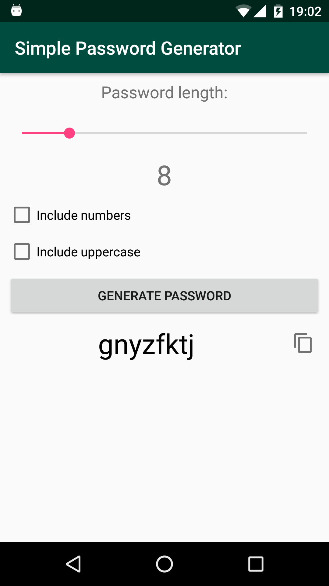

# SimplePasswordGenerator
My first project, simple android app to generate settings.
Here I used 1 activity app with basic textviews, buttons, imagebutton, seekbar, checkboxes and an algorithm for generating random passwords.

UPD: I rewrote the app architecture to Clean Architecture with RxJava 2, Dagger 2 and Data Binding.

Screenshot:

